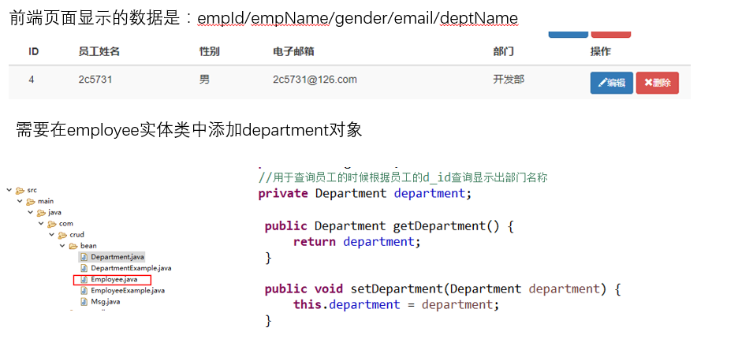
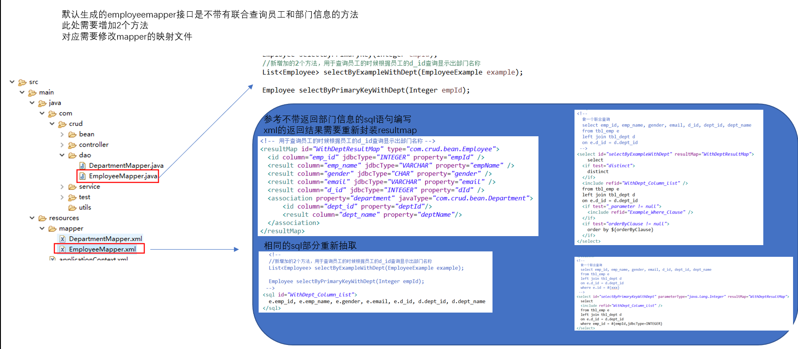
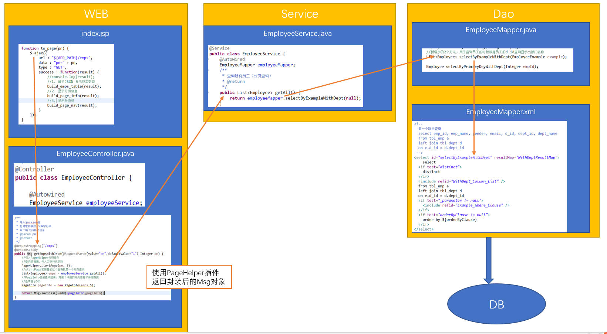

# 查询和分页显示
## 数据分析
分析前端UI，分析要从数据库获取的信息

修改Mapper映射文件


## 业务逻辑分析
1. 访问index.jsp页面
2. 发送ajax请求获取员工数据
3. 服务器返回JSON数据
4. 浏览器解析JSON数据，使用DOM增删页面

## 实现
1. 导入jackson包，把对象转换成JSON字符串，在controller中添加ResponseBody注解即可
2. 定义一个新的实体类Msg.java
	- 3个属性：
	 - 响应码（100成功 200失败）
	 - 提示信息（msg）
	 - 返回给浏览器的数据（Map<String,Object>封装）
	- 3个方法：
	 - 静态Success:返回Msg对象，设置响应吗100，提示信息处理成功
	 - 静态Fail:返回Msg对象，设置响应吗200，提示信息处理失败
	 - Add方法:用于把pageInfo放入到map中
	 ```
		public Msg add(String key, Object value) {
			this.getExtend().put(key,value);
			return this;
		}
	```
3. index.jsp使用Jquery进行拼接元素，显示表格

## 流程图


