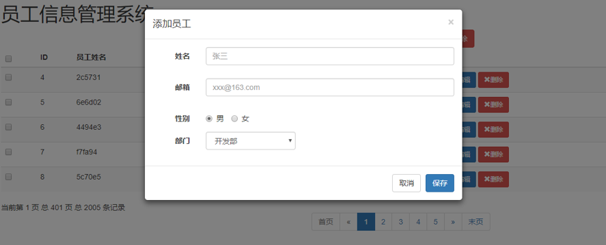
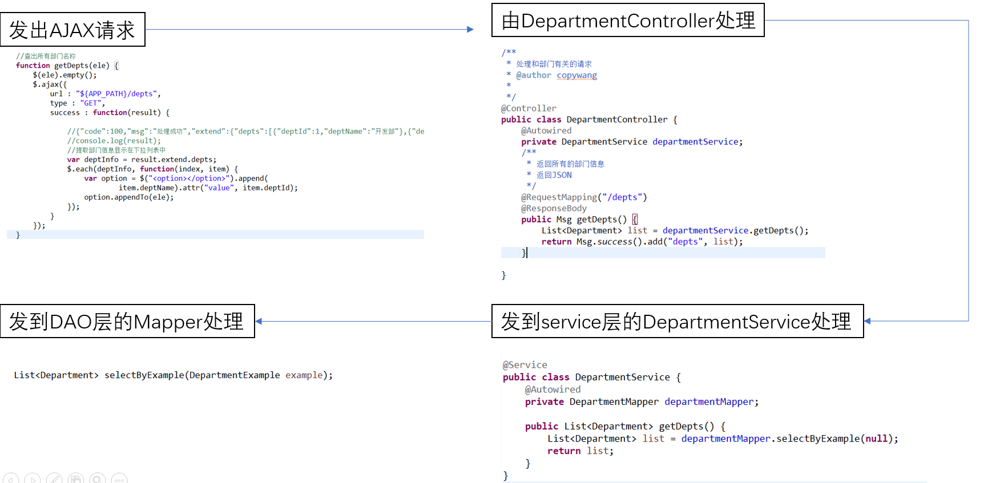
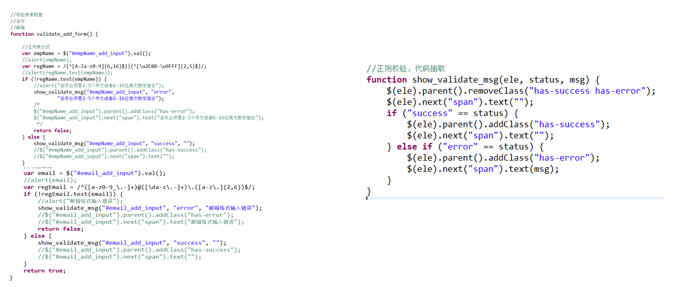
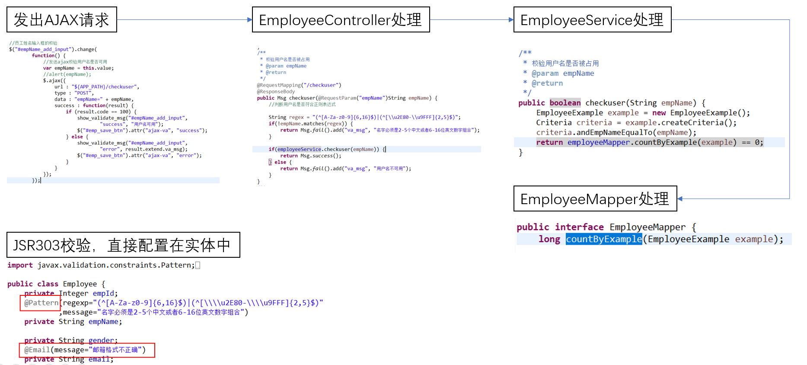
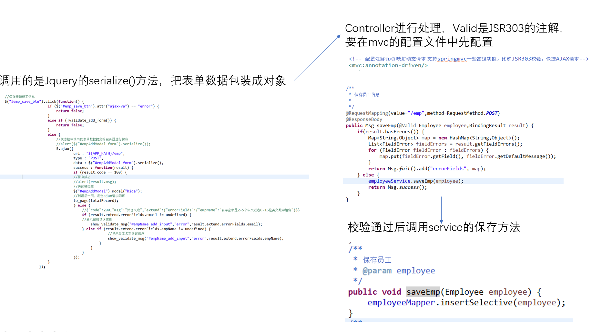

# 新增员工信息功能
## 业务逻辑
1. index.jsp页面点击新增
2. 弹出新增员工的对话框（模态框）
3. 数据库查询部门列表，显示在对话框中
4. 用户输入数据
	- 校验数据
5. 完成保存

## 数据分析

- 姓名和邮箱要做前端+后端校验
- 部门根据数据库信息返回的添加进去

### 查出部门信息

### 前端校验用户名和邮箱是否合法

### 后端校验用户名和邮箱是否合法
1. 使用的是JSR303校验
2. 当输入框输入完成移开鼠标之后，发送AJAX到服务器请求用户名是否已经存在，并且是否是合法的用户名
3. 如果校验不通过，那么保存信息的按钮应处于不可用状态

### 保存新增的员工信息
调用的是Jquery的serialize()方法，把表单数据包装成对象
