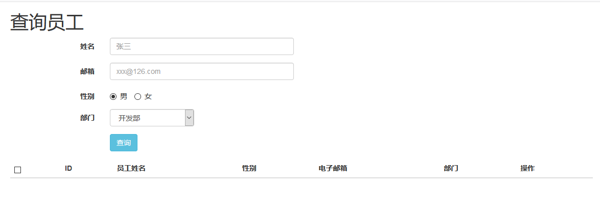

# 搜索功能
## 逻辑
1. 增加一个高级搜索的按钮，跳转到高级搜索的界面query.jsp
2. 后台需要判断输入条件

## 数据分析



## 实现
1. 表现层

```
/**
	 * 查询功能的查询员工信息
	 * 查询出来的员工数据显示在一页上面
	 */
	@RequestMapping(value="/queryEmps",method=RequestMethod.POST)
	@ResponseBody
	public Msg queryEmp(Employee employee) {
		System.out.println(employee);
		List<Employee> emplist = employeeService.queryEmp(employee);
		return Msg.success().add("emplist",emplist);
	}
```

2. Service层

```
public List<Employee> queryEmp(Employee employee) {
		// TODO Auto-generated method stub
		EmployeeExample example = new EmployeeExample();
		Criteria criteria = example.createCriteria();
		System.out.println("".equals(employee.getEmpName()));
		if (!("".equals(employee.getEmpName()))) {
			criteria.andEmpNameEqualTo(employee.getEmpName());
		}
		if(!("".equals(employee.getEmail()))) {
			criteria.andEmailEqualTo(employee.getEmail());
		}
		criteria.andGenderEqualTo(employee.getGender());
		criteria.andDIdEqualTo(employee.getdId());
		
		return employeeMapper.selectByExampleWithDept(example);
	}
```
