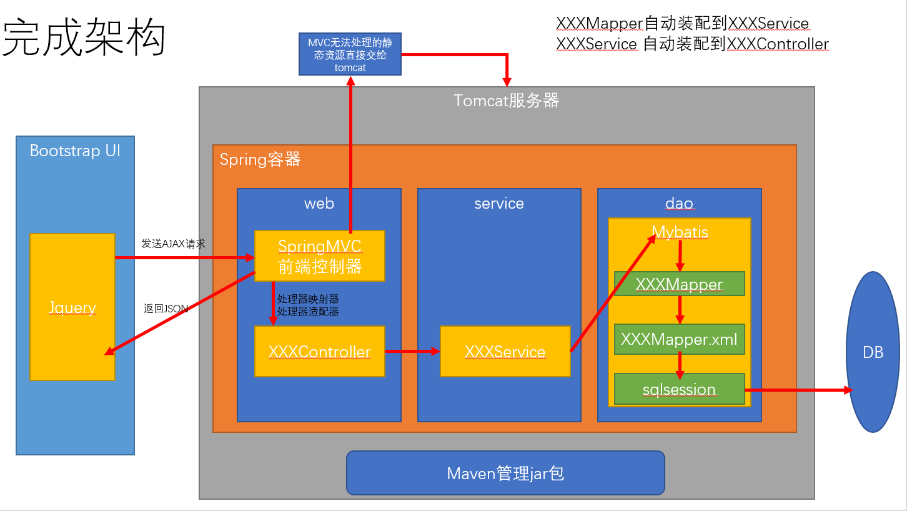
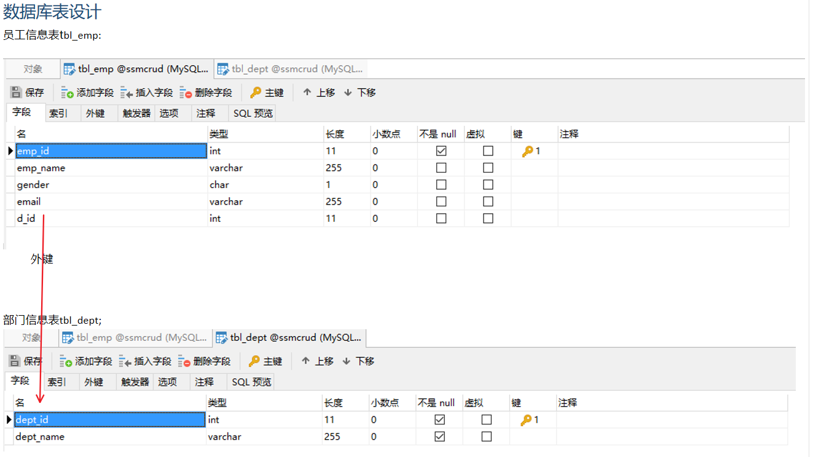

# EmployeeManagementSystem
使用SSM框架搭建的一个简单的员工信息管理系统，实现了基本的增删改查整个流程

直接把war包放到tomcat的webapps目录下，重启即可运行

## 系统架构

## 功能分解

1. 查询和分页显示
2. 新增员工信息功能
	- 数据校验，需要校验用户名和邮箱是否合法
	- 前端使用jquery校验，后端使用JSR303
3. 修改员工信息功能
4. 单个删除员工
5. 批量删除员工
6. 使用Rest风格的URI

## 技术点
 - 基础框架：SpringMVC+Spring+MyBatis
 - 数据库：MySQL
 - 前端框架：BootStrap快速搭建
 - 项目依赖管理：Maven
 - 分页：pagehelper（Mybatis的工具）
 - 逆向工程：MyBatis Generator

## 数据库表设计

## 功能实现
1. [查询和分页显示](01_queryEmpsAndPageHelper.md)
2. [新增员工信息功能](02_addEmps.md)
3. [修改员工信息功能](03_modifyEmps.md)
4. [删除员工](04_deleteEmps.md)
5. [搜索功能](05_searchEmps.md)

